# 🧠 UML Design Project – Software Design & Architecture  
**Course:** SESD-242 | **Level:** BSSE-IV | **Type:** Problem-Based Learning (PBL)

---

## 🎯 Objective  
Model and document real-world system requirements using UML diagrams and architectural principles.

---

## 🧩 System-Wide UML Artifacts

### 🧠 Domain Model
Represents key entities and their relationships.  
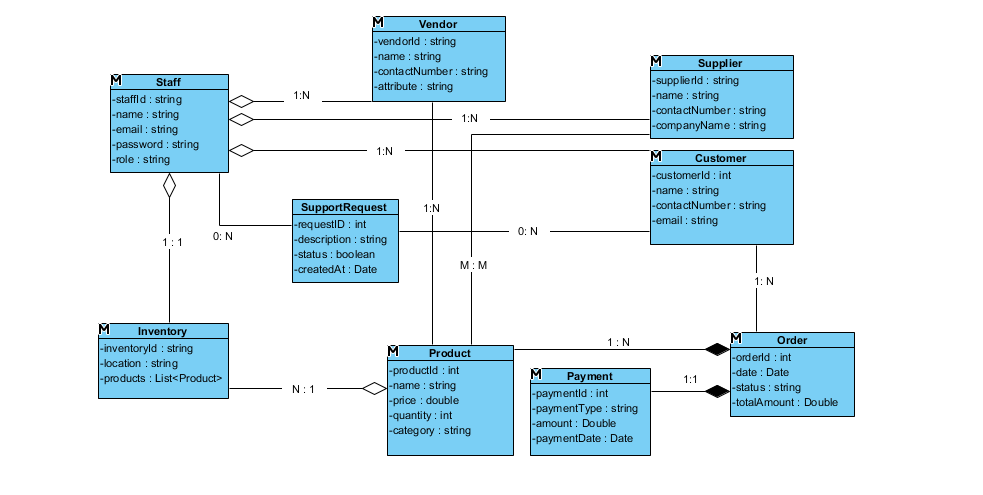

---

### 🏗️ Class Diagram
Defines system structure, attributes, operations, and associations.  
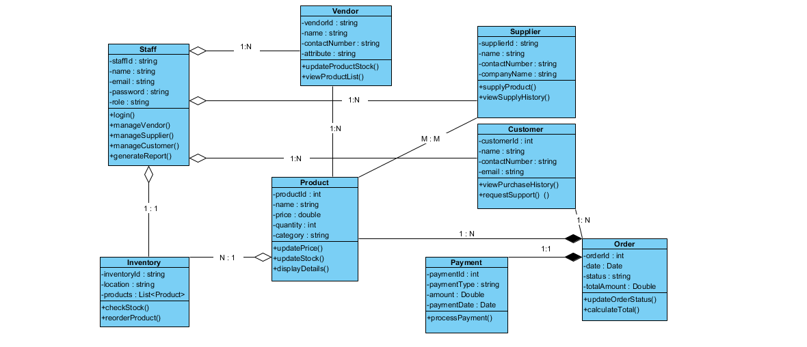

---

## 📌 Functional Requirements

### ✅ R1: Manage Products  
Add, update, delete products.  
- **Use Case:**  
  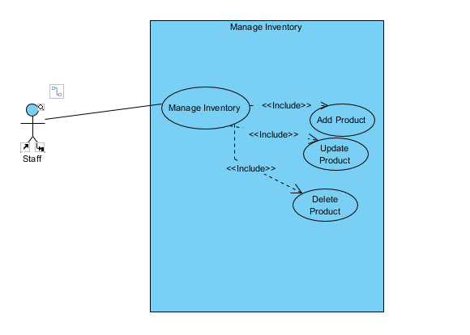  
- **Sequence Diagrams:**  
  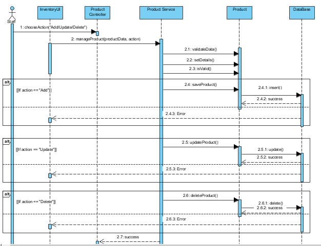

---

### ✅ R2: Manage Orders  
Create and update orders.  
- **Use Case:**  
  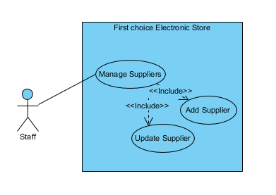  
- **Sequence Diagrams:**  
  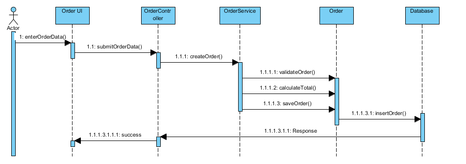

---

### ✅ R3: Manage Suppliers  
Add and update supplier info.  
- **Use Case:**  
  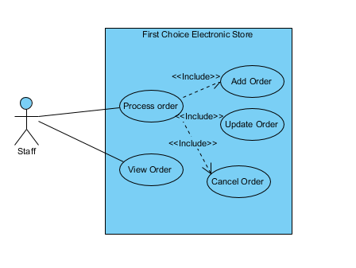  
- **Sequence Diagrams:**  
  

---

### ✅ R4: Manage Inventory  
Track and update stock levels.  
- **Use Case:**  
  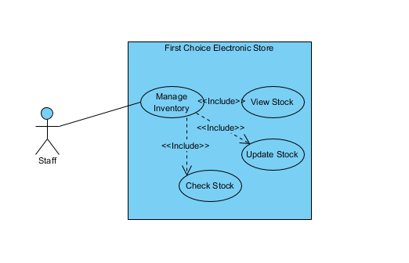  
- **Sequence Diagrams:**  
  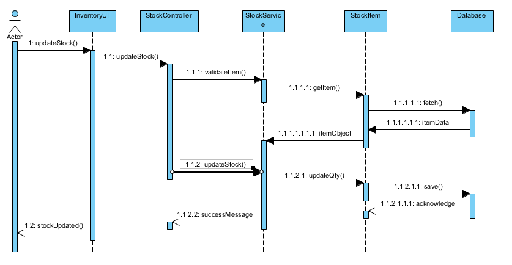

---

### ✅ R5: Generate Reports  
Generate product and sales reports.  
- **Use Case:**  
  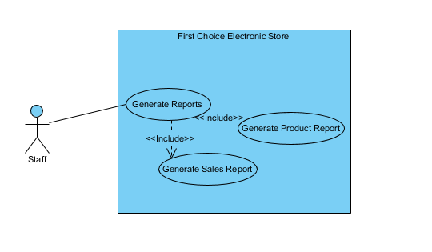  
- **Sequence Diagram:**  
  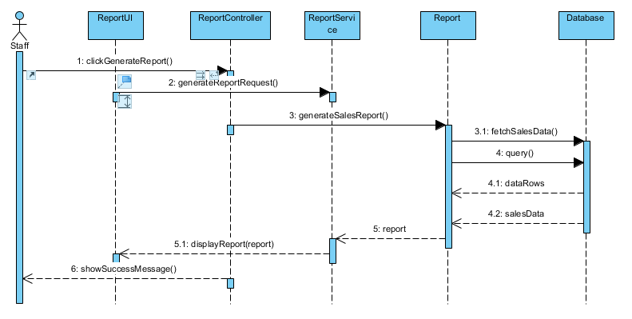

---

## 📘 Additional Artifacts

- 🔄 Activity Diagrams for selected scenarios  
- 🔘 State Machine Diagrams for dynamic behaviors  
- 📇 CRC Cards for major classes  
- 🧱 Deployment & Component Diagrams  
- 🏛️ Architectural Pattern: *[Mentioned in SDD]*  
- 📄 Software Design Document (SDD)

---

> 🚀 *Great systems begin with great designs.* This project models software.
